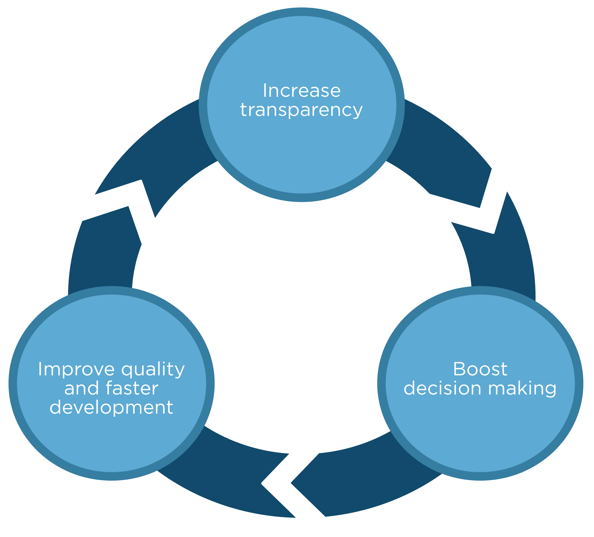

## How can we InnerSource

### Increase transparency
- Refined Permissions
- Maintained discoverable Documentation
  - Discussions and decisions
- Established roles to maintain ownership

### Boost decision making
- Clear direction of code changes
- Discoverable collaboration
- Assigned code reviewers for review

### Improve quality and faster development
- Dedicated trusted Committers
- Discoverable changes
- Code reuse
- Project ownership
- Clear contribution guidelines
- Collective organization collaboration and contribution
