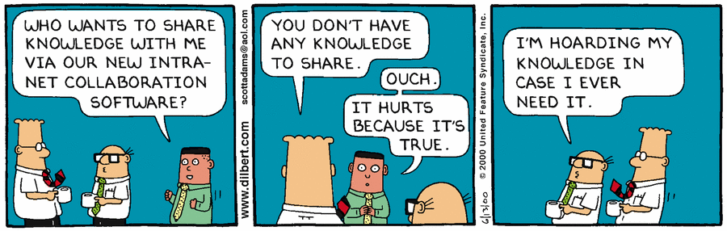

## Enablement is knowing how to start

!> **Discussion Question(s):**   What is the purpose of this repository?  How would you contribute to this repository?  What information would you add to this repository?

For InnerSource to take off at your organization, your developers need to feel safe out in the open (see: Lens 1: Culture), need to follow some best practices, and need to be equipped with modern tooling.

Let's look at some of these:

## Communication

- Can favor those in close proximity, the communication playing field may need to be leveled.
- Providing context for distributed / time-shifted team members.
- Providing context for future team members.
- Eliminating tribal knowledge.
- For communication to be open, you may need to develop psychological safety.

?> **Tip:** Effective communication doesn't happen by accident

### Tribal knowledge

!> **Discussion Question(s):**   How do we eliminate tribal knowledge?  Where does the communication playing field need leveling? Do you need new tools, and practices to do so?  Is there tribal knowledge in your team that should be discoverable among other teams?

## Discoverability

- For something to be used, it needs to first be known
- This can be something as simple as giving repos meaningful / descriptive names, and ensuring the README.md file provides the essential information.

### Passive documentation

?> **Tip**: Documentation is only useful if it’s discoverable

Passive documentation is the written record we create everyday while communicating openly.

In reference to PayPal, who adopted InnerSource practices across their entire organization, below are some key characteristics and benefits they found from passive documentation:

- A great way to get **tribal knowledge out of silos** and into a format that is archival and findable.
- Passive documentation is typically **kept with the project or the code that it documents**, thus it is in an easy-to-find, context-relevant location.
- Consists of written information that was produced not specifically to document for the future, but to explain something in the present, as it is needed. For example, it often includes the following:
  - **Conversations that mentors have with a contributor** who is learning how to integrate with her codebase.
  - **Conversations the product owners have when they are explaining their priorities to one another**, or arranging them.
  - The **connection between a piece of the code and the project stories about the code**, and the live conversations about both.

!> **Discussion Question(s):**   How is collaboration taking place inside your team today?  Are these conversations distributive or local in nature? How can you have these conversations more openly? How can you leverage GitHub to do this?

### How to capture passive Documentation

- Conversations need to be documented in a written format.
- Comments in a pull request
- Issues
- Slack conversations documented and discoverable
- Tagged emails

## Contributor friction

- To maximize contributions, it needs to be easy for people to contribute without going through tedious and convoluted channels.
- To maximize merged contributions, it needs to be easy to review contributions.

**How many of you have seen something like this in your organization?  How about your team?**

?> **Example situation**:   
**Dev1** Opens a pull request on another teams project. Tells her manager she could write the change in a few weeks. 
**Manager1** Is very pleased. 
**Dev1** Submits a pull request. Waits, and waits. **Manager1** gets upset that it’s taking so long. She tells her manager that the change hadn’t been accepted into the codebase. 
**Manager1** Talks to **Manager2** and asks him to have someone merge it in. 
**Manger2** Agrees, has someone merge it in. 
**Dev2** Doesn’t like the format of changes from **Dev1**. Rewrites the changes from **Dev1** and adds to codebase. 
No one learns anything, no documentation is discoverable, and everyone hates InnerSource because of bottlenecks. 
**Dev2** wasn't enabled to collaborate efficiently and directly with **Dev1**. 

### Creating house rules with contributing guidelines

#### Every project needs a set of house rules

Just like every good host, every repository in your organization needs a set of **house rules** to show contributors how to collaborate and contribute to your project. This is done by creating a **contributing guideline**.

### What is a contributing guideline?

A **contributing guideline** provides discoverable documentation on how a contributor can contribute as well as formalizes the responsibilities of the developers accepting code changes into their project. These guidelines aren't meant to be standardized throughout the entire organization, but the items below are recommended:

- Names of the trusted committers and their schedules (more on this in the **Trusted committer section**)
- Must have information on contributing
- Code conventions
- Testing conventions
- Branching conventions
- Commit message conventions
- Steps for creating a good pull request
- How to submit feature requests
- How to submit bug reports
- How to submit issues
- How to contribute to the documentation
- Any dependencies
- Build-process schedule
- Sprint schedule
- Road map

## Trusted Committer (TC)

Think of the TC as the developer(s) in your team, perhaps a team lead, that is trusted and highly invested in the specific team project(s). Their role is to help mentor contributors and to move code changes along. Some of their other responsibilities include:

- Writing and maintaining contribution guidelines
- Code reviews on PRs
- Maintain project dependencies
- Provide mentorship and support
- Lead discussions and help resolve issues

The [InnerSource Commons](https://innersourcecommons.org/resources/learningpath/) details specific roles that are valuable in adopting InnerSource. Some developers must take on responsibilities outside of their silos, so they created a new role with defined responsibilities and called it the Trusted Committer.

- For projects with any level of risk, you need to have a Trusted Committer.
- Trusted Committers shift back and forth between coding and Trusted Committer responsibilities.
- The Trusted Committer role is difficult, and you need to **reward those employees** who deserve and accept the role.
- The rewards to the enterprise are great: better integrated code, better code reviews, faster pull request (PR) turnaround time, clearer knowledge for refactoring, more documentation with less pain, and bottleneck reduction.

?> **Paypal's Journey**  When speaking about the Trusted Committer role, they said the following, "This is the most fundamental change we have implemented so far, and it is crucial to making InnerSource work. In fact, it is step one in its implementation."

### Cultural problems that exist with no TCs
- Codebase owners must accept pull requests or they create bottlenecks and escalations up to the management chain.
- External teams must learn to conform to the style and standards of the codebase to which they are contributing.
- When codebase owners and external contributors don’t work together, nothing gets better and everyone ends up discouraged.

### Potential organization issues with no TCs
- Developers in the enterprise environment are often unwilling to dedicate time to reviewing and accepting pull requests or mentoring developers in other areas.
- Developers typically have assigned tasks and goals that are specific to their own project, not to other projects that happen to touch their codebase. In addition, most people are disinclined to accept responsibility for something they have not written.

!> **Discussion Question(s):**   What roadblocks do you foresee with creating a TC role within your own team?

### Recognizing and rewarding TCs

 The TC role illuminates a developer’s advanced skills in mentoring, deep knowledge of architecture, and best code-review practices. Being a TC is a time consuming and important responsibility, therefore these individuals should be recognized and rewarded within their teams and the organization.

!> **Discussion Question(s):**   What are some ways you can reward and recognize the TCs within your team?  How about TC's in other teams that you contribute to?

## GitHub's Perspective

Some best practices we've discovered in the areas of communication, discoverability, reducing contributor friction have been the following:
- Adopt the practice of writing things down (Issues have largely replaced email).
- README, CONTRIBUTING, ISSUE / pull request templates, scripts to rule them all, profile repos.
- Pull requests early and often.
- Expose expertise through functional teams (few orgs, many teams).
- Automate review.
